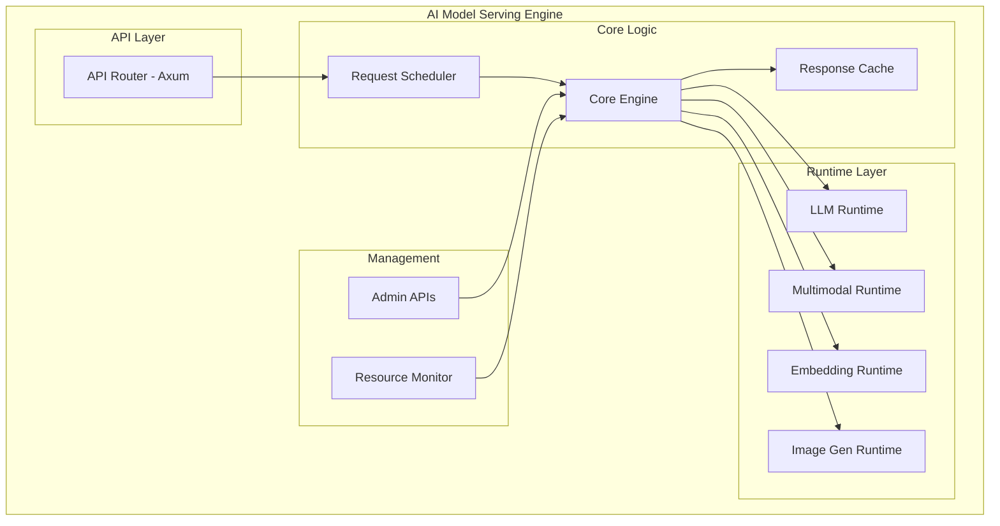

# GEMINI.md - Detailed Development Plan for AI Model Serving Engine

## 1. 🎯 Project Overview

This document is a detailed development plan and execution guide for successfully carrying out the AI Model Serving Engine project based on the requirements specified in `prd.md`.

- **Vision**: To implement a unified AI serving platform that efficiently serves LLM, multimodal, and embedding models in a local environment.
- **Mission**: To build a production-grade serving engine that provides OpenAI API compatibility, supports various AI models, and ensures high performance and stability.

## 2. 🏗️ Architecture & Tech Stack

### 2.1 Architectural Blueprint



### 2.2 Tech Stack

| Layer | Technology | Version | Reason |
|---|---|---|---|
| **Language** | Rust | 1.75+ | Performance, memory safety |
| **Web Framework** | Axum | 0.7+ | Async, type safety |
| **Async Runtime** | Tokio | 1.35+ | High-performance async processing |
| **Model Runtime** | llama.cpp, ONNX, PyTorch | latest | Support for various model formats |
| **Serialization** | Serde | 1.0+ | JSON processing |
| **Logging** | tracing | 0.1+ | Structured logging |
| **Metrics** | Prometheus | 0.13+ | Monitoring |
| **Caching** | moka | 0.12+ | High-performance cache |

## 3. 🛣️ Detailed Development Roadmap & Action Plan

Based on the roadmap in `prd.md`, we define specific action items for each phase.

### Phase 1: Text LLM MVP (4 weeks)
- **Goal**: Implement basic text LLM serving functionality compatible with the OpenAI Chat API.
- **Detailed Tasks**:
    - [x] **Initial Project Setup**
        - [x] Create project structure using `cargo` (`main.rs`, `api`, `engine`, `runtime` modules)
        - [x] Add core dependencies to `Cargo.toml` (axum, tokio, serde, tracing, llama-cpp-rs)
    - [x] **F1: Implement Chat API**
        - [x] Define OpenAI Chat API request/response DTOs using `serde` (PRD 5.3.1, 5.3.4)
        - [x] Implement the `/v1/chat/completions` route and handler using `axum`
        - [x] Implement `text/event-stream` handling logic for streaming responses
        - [x] Define and implement standard API error response formats
    - [x] **F2: Text Model Runtime**
        - [x] Define an `LlmRuntime` Trait for abstraction
        - [x] Implement `LlamaCppRuntime` using `llama.cpp` Rust bindings
        - [x] Implement GGUF/GGML model file loading and memory mapping
        - [x] Implement text generation logic for input prompts
    - [x] **F3: Core Engine & Concurrency**
        - [x] Define the `CoreEngine` struct for managing model runtimes
        - [x] Implement a request queue using `tokio::mpsc` channel
        - [x] Implement a Tokio task worker pool to process requests concurrently
        - [x] Integrate the API handler with the core engine

### Phase 2: Multimodal Support (4 weeks)
- **Goal**: Add support for embedding and vision-language models.
- **Detailed Tasks**:
    - [x] **F1: Implement Embeddings API**
        - [x] Define Embeddings API DTOs using `serde` (PRD 5.3.2)
        - [x] Implement the `/v1/embeddings` route and handler using `axum`
    - [ ] **F2: Embedding Model Runtime**
        - [x] Define an `EmbeddingRuntime` Trait
        - [ ] Implement inference logic for Sentence Transformers series models using ONNX runtime (ort)
        - [x] Integrate the embedding runtime into the `CoreEngine`
        - [x] Add ONNX runtime scaffolding behind `onnx` feature and env-based auto-load
    - [x] **F1/F2: Vision-Language Model Support**
        - [x] Extend Chat API DTOs to support vision inputs
        - [x] Define a `MultimodalRuntime` Trait and dummy implementation
        - [ ] Support LLaVA model architecture (CLIP Vision Encoder + LLM)
        - [x] Integrate the multimodal runtime into the `CoreEngine` and add routing logic

### Phase 3: Stabilization & Management (3 weeks)
- **Goal**: Ensure stability and management features for production operation.
- **Detailed Tasks**:
    - [x] **F4: Response Caching**
        - [x] Add `moka` dependency and initialize the cache instance
        - [x] Add LRU caching logic within the `CoreEngine` (using request hash as key)
        - [x] Implement cache TTL (Time-To-Live) configuration
    - [x] **F5: Dynamic Model Management**
        - [x] Implement `POST /admin/models/load` and `POST /admin/models/unload` API endpoints
        - [x] Modify the `CoreEngine` to dynamically load/unload models without service interruption (e.g., using `Arc<Mutex<HashMap>>`)
        - [x] Implement functionality to view the list and status of currently loaded models via `GET /admin/models`
    - [x] **F6: Service Monitoring**
        - [x] Add `metrics` and `metrics-exporter-prometheus` dependencies
        - [x] Add code to collect key metrics (request count, latency, cache hit/store/miss)
        - [x] Implement the `/admin/metrics` endpoint
        - [x] Implement the `/health` health check endpoint

### Phase 4: Image Generation & Enhancements (5 weeks)
- **Goal**: Implement support for image generation models and advanced features.
- **Detailed Tasks**:
    - [ ] **F1: Implement Image Generation API**
        - [ ] Define Image Generation API DTOs using `serde` (PRD 5.3.3)
        - [ ] Implement the `/v1/images/generations` route and handler using `axum`
    - [ ] **F2: Image Generation Runtime**
        - [ ] Define an `ImageGenRuntime` Trait
        - [ ] Implement inference logic for Stable Diffusion models (using ONNX or PyTorch bindings)
        - [ ] Integrate the image generation runtime into the `CoreEngine`
    - [ ] **F8: Multi-Type Model Concurrent Serving**
        - [ ] Refactor the `CoreEngine` to manage various types of models concurrently (LLM, Embedding, Multimodal, Image Gen)
        - [ ] Implement logic to route requests to the appropriate runtime based on the `model` field in the API request
    - [ ] **F9: Authentication & Authorization**
        - [ ] Implement Bearer Token authentication logic using `axum` middleware
        - [ ] Implement per-API key Rate Limiting logic (using the `governor` crate)

### Phase 5: Decentralization (6 weeks)
- **Goal**: Support scalability in a distributed environment based on Kubernetes.
- **Detailed Tasks**:
    - [ ] **F10: Containerization**
        - [ ] Create a lightweight production Docker image using a multi-stage build
        - [ ] Include the NVIDIA CUDA runtime in the Docker image for GPU support
    - [ ] **F10: Kubernetes Deployment**
        - [ ] Create a deployment chart using `Helm` (Deployment, Service, ConfigMap, Secret)
        - [ ] Configure Liveness/Readiness Probes using the `/health` endpoint
        - [ ] Set up resource requests and limits for the HPA (Horizontal Pod Autoscaler)
        - [ ] Configure `deployment.yaml` to request and use GPU resources

## 4. ⚙️ Development Process & Principles

### 4.1 Test-Driven Development (TDD)

- All feature development will follow the **Test-Driven Development (TDD)** methodology.
- We will adhere to the **`Red-Green-Refactor`** cycle: first write a failing test, then write the code to pass the test, and finally refactor the code.
- All API endpoints, core logic, and utility functions must be verified with unit tests (`cargo test`) and integration tests. As specified in the PRD, we aim for a **test coverage of over 80%**.

### 4.2 Version Control & History

- **Git Commit Strategy**: Upon completion of each phase, all changes for that phase will be committed as a single atomic unit. The commit message will follow the format `feat(phase-X): [Phase Name]` (e.g., `feat(phase-1): Complete Text LLM MVP`).
- **Work History Management**: At the end of each phase, a `history.md` file will be created and updated with the work history in the following format. This is to track project progress, share knowledge, and facilitate continuous improvement.

```markdown
# Work History

## Phase X: [Phase Name]

- **Duration:** YYYY-MM-DD ~ YYYY-MM-DD
- **Completed Work:**
  - [List of detailed tasks for the Phase as defined in GEMINI.md]
- **Issues Encountered:**
  - **Issue 1:** [Specific description of the problem]
  - **Cause:** [Analysis of the root cause of the problem]
  - **Solution:** [Methods attempted to solve the problem and the final solution]
- **Retrospective:**
  - **What went well:** [Positive aspects of the process, technology choices, collaboration, etc.]
  - **What to improve:** [Areas for improvement in the next Phase]
```

## 5. 📝 References & Notes

- This development plan is based on the `prd.md` document.
- The content of `plan.md` was not provided. This document will be further updated to refine the plan once its content is shared.
- Tests for each stage (unit, integration, performance) will be conducted in parallel.


## 1. 🎯 프로젝트 개요 (Project Overview)

이 문서는 `prd.md`에 명시된 요구사항을 기반으로 AI Model Serving Engine 프로젝트를 성공적으로 수행하기 위한 상세 개발 계획 및 실행 가이드입니다.

- **비전 (Vision)**: 로컬 환경에서 LLM, 멀티모달, 임베딩 모델을 효율적으로 서빙하는 통합 AI 서빙 플랫폼을 구현합니다.
- **미션 (Mission)**: OpenAI API와 호환성을 제공하며, 다양한 AI 모델을 지원하고, 높은 성능과 안정성을 보장하는 프로덕션급 서빙 엔진을 구축합니다.

## 2. 🏗️ 아키텍처 및 기술 스택 (Architecture & Tech Stack)

### 2.1 아키텍처 청사진 (Architectural Blueprint)


### 4.3 Task Lifecycle Rule (per-task)

- For every task derived from this document:
  - Complete development and ensure tests pass: `cargo test`.
  - Update `history.md` with:
    - Completed work (concise bullets)
    - Issues encountered
    - Root cause and solution
    - Retrospective (what went well, what to improve)
  - Commit with a message starting with `feat(phase-X):`, `fix(phase-X):`, or `chore(phase-X):` as appropriate.
  - Push to `origin`.
  - Optional helper: use `scripts/finish_task.sh` to append a standardized entry.

### 2.2 기술 스택 (Tech Stack)

| 계층 | 기술 | 버전 | 이유 |
|------|------|------|------|
| **언어** | Rust | 1.75+ | 성능, 메모리 안전성 |
| **웹 프레임워크** | Axum | 0.7+ | 비동기, 타입 안전성 |
| **비동기 런타임** | Tokio | 1.35+ | 고성능 비동기 처리 |
| **모델 런타임** | llama.cpp, ONNX, PyTorch | latest | 다양한 모델 형식 지원 |
| **직렬화** | Serde | 1.0+ | JSON 처리 |
| **로깅** | tracing | 0.1+ | 구조화 로깅 |
| **메트릭** | Prometheus | 0.13+ | 모니터링 |
| **캐싱** | moka | 0.12+ | 고성능 캐시 |

## 3. 🛣️ 상세 개발 로드맵 및 실행 계획 (Detailed Development Roadmap & Action Plan)

`prd.md`의 로드맵을 기반으로 각 단계별 구체적인 실행 과제를 정의합니다.

### Phase 1: 텍스트 LLM MVP (4주)
- **목표**: OpenAI Chat API와 호환되는 기본 텍스트 LLM 서빙 기능 구현.
- **세부 과제**:
    - [x] **프로젝트 초기 설정**
        - [x] `cargo`를 이용한 프로젝트 구조 생성 (`main.rs`, `api`, `engine`, `runtime` 모듈)
        - [x] `Cargo.toml`에 핵심 의존성 추가 (axum, tokio, serde, tracing, llama-cpp-rs)
    - [x] **F1: Chat API 구현**
        - [x] `serde`를 사용하여 OpenAI Chat API 요청/응답 DTO 정의 (PRD 5.3.1, 5.3.4)
        - [x] `axum`을 사용하여 `/v1/chat/completions` 라우트 및 핸들러 구현
        - [x] 스트리밍 응답을 위한 `text/event-stream` 처리 로직 구현
        - [x] 표준 API 에러 응답 형식 정의 및 구현
    - [ ] **F2: 텍스트 모델 런타임**
        - [x] `LlmRuntime` Trait 정의 (추상화)
        - [ ] `llama.cpp` Rust 바인딩을 사용한 `LlamaCppRuntime` 구현
        - [ ] GGUF/GGML 모델 파일 로딩 및 메모리 매핑 기능 구현
        - [x] 입력 프롬프트에 대한 텍스트 생성 로직 구현
    - [ ] **F3: 코어 엔진 및 동시성 처리**
        - [x] `CoreEngine` 구조체 정의 (모델 런타임 관리)
        - [x] `tokio::mpsc` 채널을 사용한 요청 큐(Queue) 구현
        - [ ] 여러 요청을 동시에 처리하기 위한 Tokio 태스크 워커 풀(Worker Pool) 구현
        - [x] API 핸들러와 코어 엔진 연동

### Phase 2: 멀티모달 지원 (4주)
- **목표**: 임베딩 및 비전-언어 모델 지원 추가.
- **세부 과제**:
    - [ ] **F1: Embeddings API 구현**
        - [ ] `serde`를 사용하여 Embeddings API DTO 정의 (PRD 5.3.2)
        - [ ] `axum`을 사용하여 `/v1/embeddings` 라우트 및 핸들러 구현
    - [ ] **F2: 임베딩 모델 런타임**
        - [ ] `EmbeddingRuntime` Trait 정의
        - [ ] ONNX 런타임(ort)을 사용하여 Sentence Transformers 계열 모델 추론 로직 구현
        - [ ] `CoreEngine`에 임베딩 런타임 통합
    - [ ] **F1/F2: Vision-Language 모델 지원**
        - [ ] Chat API DTO를 확장하여 `image_url` 입력 지원 (PRD 5.3.1)
        - [ ] `MultimodalRuntime` Trait 정의
        - [ ] LLaVA 모델 아키텍처 지원 (CLIP Vision Encoder + LLM)
        - [ ] `CoreEngine`에 멀티모달 런타임 통합 및 라우팅 로직 추가

### Phase 3: 안정화 및 관리 (3주)
- **목표**: 프로덕션 운영을 위한 안정성 및 관리 기능 확보.
- **세부 과제**:
    - [ ] **F4: 응답 캐싱**
        - [ ] `moka` 의존성 추가 및 캐시 인스턴스 초기화
        - [ ] `CoreEngine` 내부에 LRU 캐싱 로직 추가 (요청 해시 기반 키)
        - [ ] 캐시 TTL(Time-To-Live) 설정 기능 구현
    - [ ] **F5: 동적 모델 관리**
        - [ ] `POST /admin/models/load`, `POST /admin/models/unload` API 엔드포인트 구현
        - [ ] `CoreEngine`이 서비스 중단 없이 모델을 동적으로 로드/언로드 하도록 수정 (`Arc<Mutex<HashMap>>` 등 활용)
        - [ ] `GET /admin/models`를 통해 현재 로드된 모델 목록 및 상태 조회 기능 구현
    - [ ] **F6: 서비스 모니터링**
        - [ ] `metrics` 및 `metrics-exporter-prometheus` 의존성 추가
        - [ ] 주요 지표(요청 수, 지연 시간, 에러율, 캐시 히트율) 수집 코드 추가
        - [ ] `/admin/metrics` 엔드포인트 구현
        - [ ] `/health` 헬스체크 엔드포인트 구현

### Phase 4: 이미지 생성 및 고도화 (5주)
- **목표**: 이미지 생성 모델 지원 및 고급 기능 구현.
- **세부 과제**:
    - [ ] **F1: Image Generation API 구현**
        - [ ] `serde`를 사용하여 Image Generation API DTO 정의 (PRD 5.3.3)
        - [ ] `axum`을 사용하여 `/v1/images/generations` 라우트 및 핸들러 구현
    - [ ] **F2: 이미지 생성 런타임**
        - [ ] `ImageGenRuntime` Trait 정의
        - [ ] Stable Diffusion 모델 추론 로직 구현 (ONNX 또는 PyTorch 바인딩 활용)
        - [ ] `CoreEngine`에 이미지 생성 런타임 통합
    - [ ] **F8: 멀티타입 모델 동시 서빙**
        - [ ] `CoreEngine`을 리팩토링하여 여러 종류의 모델(LLM, Embedding, Multimodal, Image Gen)을 동시에 관리하도록 개선
        - [ ] API 요청의 `model` 필드를 기반으로 적절한 런타임으로 라우팅하는 로직 구현
    - [ ] **F9: 인증 및 권한 관리**
        - [ ] `axum` 미들웨어를 사용하여 Bearer 토큰 인증 로직 구현
        - [ ] API 키별 Rate Limiting 로직 구현 (`governor` 크레이트 활용)

### Phase 5: 분산화 (6주)
- **목표**: Kubernetes 기반의 분산 환경에서 확장 가능하도록 지원.
- **세부 과제**:
    - [ ] **F10: 컨테이너화**
        - [ ] Multi-stage build를 활용하여 프로덕션용 경량 Docker 이미지 생성
        - [ ] Docker 이미지에 NVIDIA CUDA 런타임 포함하여 GPU 지원
    - [ ] **F10: Kubernetes 배포**
        - [ ] `Helm`을 사용하여 배포 차트 작성 (Deployment, Service, ConfigMap, Secret)
        - [ ] `/health` 엔드포인트를 사용하는 Liveness/Readiness Probe 설정
        - [ ] HPA(Horizontal Pod Autoscaler)를 위한 리소스 요청 및 제한 설정
        - [ ] GPU 리소스를 요청하고 사용하도록 `deployment.yaml` 설정

## 4. ⚙️ 개발 프로세스 및 원칙 (Development Process & Principles)

### 4.1 테스트 주도 개발 (Test-Driven Development - TDD)

- 모든 기능 개발은 **테스트 주도 개발(TDD)** 방법론을 따릅니다.
- **`Red-Green-Refactor`** 사이클을 준수하여, 실패하는 테스트를 먼저 작성하고, 테스트를 통과하는 코드를 작성한 뒤, 코드를 리팩토링합니다.
- 모든 API 엔드포인트, 핵심 로직, 유틸리티 함수는 단위 테스트(`cargo test`) 및 통합 테스트로 검증되어야 합니다. PRD에 명시된 대로 **테스트 커버리지 80% 이상**을 목표로 합니다.

### 4.2 버전 관리 및 히스토리

- **Git Commit 전략**: 각 Phase의 개발이 완료되면, 해당 Phase의 모든 변경사항을 하나의 원자적 단위로 커밋합니다. 커밋 메시지는 `feat(phase-X): [Phase 이름]` 형식을 따릅니다. (예: `feat(phase-1): Complete Text LLM MVP`)
- **작업 이력 관리**: 각 Phase가 종료될 때마다, `history.md` 파일을 생성하고 다음 형식에 따라 작업 내역을 기록합니다. 이는 프로젝트의 진행 상황을 추적하고, 지식을 공유하며, 지속적인 개선을 위함입니다.

```markdown
# Work History

## Phase X: [Phase 이름]

- **작업 기간 (Duration):** YYYY-MM-DD ~ YYYY-MM-DD
- **완료된 작업 (Completed Work):**
  - [GEMINI.md에 정의된 Phase의 세부 과제 목록]
- **발생 이슈 (Issues Encountered):**
  - **이슈 1:** [문제 상황에 대한 구체적인 설명]
  - **원인:** [문제의 근본 원인 분석]
  - **해결 방안:** [문제를 해결하기 위해 시도한 방법 및 최종 해결책]
- **회고 (Retrospective):**
  - **잘한 점 (What went well):** [프로세스, 기술 선택, 협업 등에서 긍정적이었던 부분]
  - **개선할 점 (What to improve):** [다음 Phase에서 개선하고 싶은 부분]
```

## 5. 📝 참고 및 ملاحظات (References & Notes)

- 이 개발 계획은 `prd.md` 문서를 기반으로 작성되었습니다.
- `plan.md` 파일의 내용이 제공되지 않았습니다. 해당 파일의 내용이 공유되면 이 문서를 추가적으로 업데이트하여 계획을 구체화할 예정입니다.
- 각 단계별 테스트(단위, 통합, 성능)는 병행하여 진행합니다.