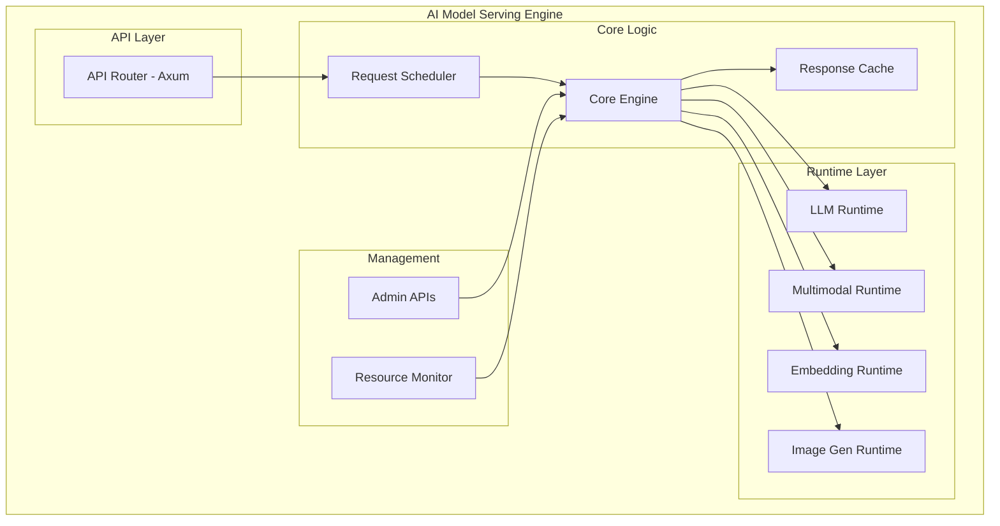

# GEMINI.md - Detailed Development Plan for AI Model Serving Engine

## 1. 🎯 Project Overview

This document is a detailed development plan and execution guide for successfully carrying out the AI Model Serving Engine project based on the requirements specified in `prd.md`.

- **Vision**: To implement a unified AI serving platform that efficiently serves LLM, multimodal, and embedding models in a local environment.
- **Mission**: To build a production-grade serving engine that provides OpenAI API compatibility, supports various AI models, and ensures high performance and stability.

## 2. 🏗️ Architecture & Tech Stack

### 2.1 Architectural Blueprint



### 2.2 Tech Stack

| Layer | Technology | Version | Reason |
|---|---|---|---|
| **Language** | Rust | 1.75+ | Performance, memory safety |
| **Web Framework** | Axum | 0.7+ | Async, type safety |
| **Async Runtime** | Tokio | 1.35+ | High-performance async processing |
| **Model Runtime** | llama.cpp, ONNX, PyTorch | latest | Support for various model formats |
| **Serialization** | Serde | 1.0+ | JSON processing |
| **Logging** | tracing | 0.1+ | Structured logging |
| **Metrics** | Prometheus | 0.13+ | Monitoring |
| **Caching** | moka | 0.12+ | High-performance cache |

## 3. 🛣️ Detailed Development Roadmap & Action Plan

Based on the roadmap in `prd.md`, we define specific action items for each phase.

### Phase 1: Text LLM MVP (4 weeks)
- **Goal**: Implement basic text LLM serving functionality compatible with the OpenAI Chat API.
- **Detailed Tasks**:
    - [x] **Initial Project Setup**
        - [x] Create project structure using `cargo` (`main.rs`, `api`, `engine`, `runtime` modules)
        - [x] Add core dependencies to `Cargo.toml` (axum, tokio, serde, tracing, llama-cpp-rs)
    - [x] **F1: Implement Chat API**
        - [x] Define OpenAI Chat API request/response DTOs using `serde` (PRD 5.3.1, 5.3.4)
        - [x] Implement the `/v1/chat/completions` route and handler using `axum`
        - [x] Implement `text/event-stream` handling logic for streaming responses
        - [x] Define and implement standard API error response formats
    - [x] **F2: Text Model Runtime**
        - [x] Define an `LlmRuntime` Trait for abstraction
        - [x] Implement `LlamaCppRuntime` using `llama.cpp` Rust bindings
        - [x] Implement GGUF/GGML model file loading and memory mapping
        - [x] Implement text generation logic for input prompts
    - [x] **F3: Core Engine & Concurrency**
        - [x] Define the `CoreEngine` struct for managing model runtimes
        - [x] Implement a request queue using `tokio::mpsc` channel
        - [x] Implement a Tokio task worker pool to process requests concurrently
        - [x] Integrate the API handler with the core engine

### Phase 2: Multimodal Support (4 weeks)
- **Goal**: Add support for embedding and vision-language models.
- **Detailed Tasks**:
    - [x] **F1: Implement Embeddings API**
        - [x] Define Embeddings API DTOs using `serde` (PRD 5.3.2)
        - [x] Implement the `/v1/embeddings` route and handler using `axum`
    - [x] **F2: Embedding Model Runtime**
        - [x] Define an `EmbeddingRuntime` Trait
        - [x] Implement inference logic for Sentence Transformers series models using ONNX runtime (ort)
        - [x] Integrate the embedding runtime into the `CoreEngine`
        - [x] Add ONNX runtime scaffolding behind `onnx` feature and env-based auto-load
    - [x] **F1/F2: Vision-Language Model Support**
        - [x] Extend Chat API DTOs to support vision inputs (OpenAI-compatible content parts)
        - [x] Define a `MultimodalRuntime` Trait and dummy implementation
        - [ ] Support LLaVA model architecture (CLIP Vision Encoder + LLM)
            - [x] Add feature-gated LLaVA runtime scaffold and env-based auto-load
        - [x] Integrate the multimodal runtime into the `CoreEngine` and add routing logic

### Phase 3: Stabilization & Management (3 weeks)
- **Goal**: Ensure stability and management features for production operation.
- **Detailed Tasks**:
    - [x] **F4: Response Caching**
        - [x] Add `moka` dependency and initialize the cache instance
        - [x] Add LRU caching logic within the `CoreEngine` (using request hash as key)
        - [x] Implement cache TTL (Time-To-Live) configuration
    - [x] **F5: Dynamic Model Management**
        - [x] Implement `POST /admin/models/load` and `POST /admin/models/unload` API endpoints
        - [x] Modify the `CoreEngine` to dynamically load/unload models without service interruption (e.g., using `Arc<Mutex<HashMap>>`)
        - [x] Implement functionality to view the list and status of currently loaded models via `GET /admin/models`
    - [x] **F6: Service Monitoring**
        - [x] Add `metrics` and `metrics-exporter-prometheus` dependencies
        - [x] Add code to collect key metrics (request count, latency, cache hit/store/miss)
        - [x] Implement the `/admin/metrics` endpoint
        - [x] Implement the `/health` health check endpoint

### Phase 4: Image Generation & Enhancements (5 weeks)
- **Goal**: Implement support for image generation models and advanced features.
- **Detailed Tasks**:
    - [x] **F1: Implement Image Generation API**
        - [x] Define Image Generation API DTOs using `serde` (PRD 5.3.3)
        - [x] Implement the `/v1/images/generations` route and handler using `axum`
    - [ ] **F2: Image Generation Runtime**
        - [x] Define an `ImageGenRuntime` Trait
        - [ ] Implement inference logic for Stable Diffusion models (using ONNX or PyTorch bindings)
        - [x] Integrate the image generation runtime into the `CoreEngine`
    - [x] **F8: Multi-Type Model Concurrent Serving**
        - [x] Refactor the `CoreEngine` to manage various types of models concurrently (LLM, Embedding, Multimodal, Image Gen)
        - [x] Implement logic to route requests to the appropriate runtime based on the `model` field in the API request
    - [x] **F9: Authentication & Authorization**
        - [x] Implement Bearer Token authentication logic using `axum`
        - [x] Implement per-API key Rate Limiting logic (using the `governor` crate)

### Phase 5: Decentralization (6 weeks)
- **Goal**: Support scalability in a distributed environment based on Kubernetes.
- **Detailed Tasks**:
    - [ ] **F10: Containerization**
        - [ ] Create a lightweight production Docker image using a multi-stage build
        - [ ] Include the NVIDIA CUDA runtime in the Docker image for GPU support
    - [ ] **F10: Kubernetes Deployment**
        - [ ] Create a deployment chart using `Helm` (Deployment, Service, ConfigMap, Secret)
        - [ ] Configure Liveness/Readiness Probes using the `/health` endpoint
        - [ ] Set up resource requests and limits for the HPA (Horizontal Pod Autoscaler)
        - [ ] Configure `deployment.yaml` to request and use GPU resources

## 4. ⚙️ Development Process & Principles

### 4.1 Test-Driven Development (TDD)

- All feature development will follow the **Test-Driven Development (TDD)** methodology.
- We will adhere to the **`Red-Green-Refactor`** cycle: first write a failing test, then write the code to pass the test, and finally refactor the code.
- All API endpoints, core logic, and utility functions must be verified with unit tests (`cargo test`) and integration tests. As specified in the PRD, we aim for a **test coverage of over 80%**.

### 4.2 Version Control & History

- **Git Commit Strategy**: Upon completion of each phase, all changes for that phase will be committed as a single atomic unit. The commit message will follow the format `feat(phase-X): [Phase Name]` (e.g., `feat(phase-1): Complete Text LLM MVP`).
- **Work History Management**: At the end of each phase, a `history.md` file will be created and updated with the work history in the following format. This is to track project progress, share knowledge, and facilitate continuous improvement.

```markdown
# Work History

## Phase X: [Phase Name]

- **Duration:** YYYY-MM-DD ~ YYYY-MM-DD
- **Completed Work:**
  - [List of detailed tasks for the Phase as defined in GEMINI.md]
- **Issues Encountered:**
  - **Issue 1:** [Specific description of the problem]
  - **Cause:** [Analysis of the root cause of the problem]
  - **Solution:** [Methods attempted to solve the problem and the final solution]
- **Retrospective:**
  - **What went well:** [Positive aspects of the process, technology choices, collaboration, etc.]
  - **What to improve:** [Areas for improvement in the next Phase]
```

## 5. 📝 References & Notes

- This development plan is based on the `prd.md` document.
- The content of `plan.md` was not provided. This document will be further updated to refine the plan once its content is shared.
- Tests for each stage (unit, integration, performance) will be conducted in parallel.
