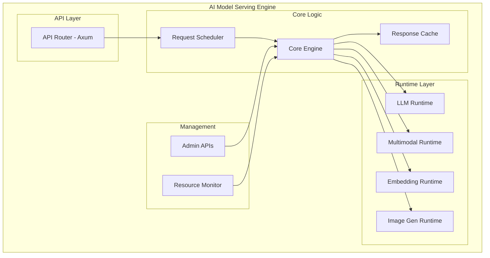

# LLM Serving Engine

A production-oriented, local AI model serving engine with OpenAI-compatible APIs. Phase 1 delivers a Text LLM MVP with chat completions and SSE streaming.

## Project Overview

- Vision: Implement a unified AI serving platform that efficiently serves LLM, multimodal, and embedding models in a local environment.
- Mission: Build a production-grade serving engine that provides OpenAI API compatibility, supports various AI models, and ensures high performance and stability.

See `GEMINI.md` for the full roadmap and `history.md` for progress logs.

## Architecture



### Tech Stack
- Language: Rust (edition 2024; recommended rustc 1.75+)
- Web: Axum 0.7, Hyper 1.x, Tokio 1.x
- Serialization: Serde 1.x
- Logging: tracing, tracing-subscriber
- Optional Runtime: `llama_cpp` (feature-gated as `llama`)

## Current Features (Phase 1)
- OpenAI-compatible Chat Completions endpoint: `POST /v1/chat/completions`
- Streaming responses via Server-Sent Events (`text/event-stream`) with `[DONE]` sentinel
- Core engine with request queue (`tokio::mpsc`) and worker task
- Pluggable runtime abstraction (`LlmRuntime`)
  - Default `DummyRuntime` for local development
  - Optional `LlamaCppRuntime` behind `llama` feature; loads model from `LLAMA_MODEL_PATH`
- Basic integration tests for non-stream and stream flows

## Repository Layout
- `src/main.rs`: Server bootstrap and routes setup
- `src/lib.rs`: Library entry for tests
- `src/api/`: DTOs, error types, and route handlers
- `src/engine/`: Core engine, request queue, worker
- `src/runtime/`: Runtime trait and implementations (`dummy`, optional `llama_cpp`)
- `tests/`: Integration tests (Axum router level)

## Prerequisites
- Rust toolchain (edition 2024; rustup recommended)
- macOS/Linux recommended

## Build
- Default (Dummy runtime only):
```bash
cargo build
```
- With llama.cpp runtime support:
```bash
cargo build --features llama
```

## Run
- Default (Dummy runtime):
```bash
cargo run
```
- With llama.cpp runtime (requires a valid GGUF model path):
```bash
LLAMA_MODEL_PATH=/path/to/model.gguf cargo run --features llama
```
- Server listens on `0.0.0.0:3000` by default.

### Environment Variables
- `LLAMA_MODEL_PATH`: Filesystem path to the llama GGUF model (used when `--features llama` is enabled)
- `RUST_LOG`: Control logging (e.g., `RUST_LOG=info`)

## API Usage

### Chat Completions (non-stream)
Request:
```bash
curl -s \
  -H "Content-Type: application/json" \
  -X POST http://localhost:3000/v1/chat/completions \
  -d '{
        "model": "dummy-model",
        "messages": [{"role": "user", "content": "Hello"}]
      }'
```
Response (example):
```json
{
  "id": "...",
  "object": "chat.completion",
  "created": 1234567890,
  "model": "dummy-model",
  "choices": [
    {
      "index": 0,
      "message": {"role": "assistant", "content": "Echo: Hello"},
      "finish_reason": "stop"
    }
  ],
  "usage": {"prompt_tokens": 0, "completion_tokens": 0, "total_tokens": 0}
}
```

### Chat Completions (stream)
Request:
```bash
curl -N \
  -H "Content-Type: application/json" \
  -X POST http://localhost:3000/v1/chat/completions \
  -d '{
        "model": "dummy-model",
        "messages": [{"role": "user", "content": "Hello"}],
        "stream": true
      }'
```
Behavior:
- Sends SSE chunks with `chat.completion.chunk` JSON
- Ends with `[DONE]`

## Develop & Test
- Run tests:
```bash
cargo test
```
- Suggested workflow: update tests first (TDD), then implement features.

## Roadmap
- See `GEMINI.md` for multi-phase plan:
  - Phase 2: Embeddings and vision-language
  - Phase 3: Caching, admin, monitoring
  - Phase 4: Image generation and enhancements
  - Phase 5: Containerization and Kubernetes
